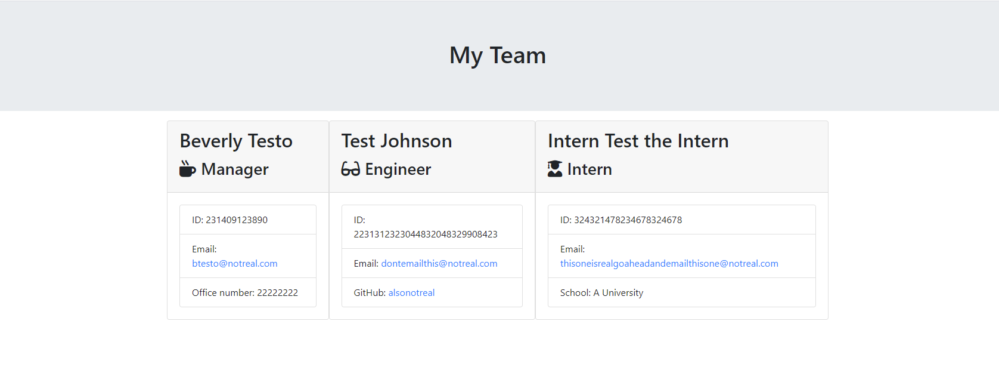

# Homework 9 - Team Roster Generator

## Table of Contents

1. [Description](#description)
2. [Installation](#installation)
3. [Usage](#usage)
4. [License](#license)
5. [Tests](#tests)
6. [Questions](#questions)

## Description:
Generates an HTML file displaying a roster of employees with information collected from the user using Inquirer. App was developed with test driven development through use of jest.

## Installation: 
Requires npm dependencies jest and Inquirer. Application to be run with node.js.

## License: 
MIT

## Contributing: 
[Myrmoxenus](https://github.com/Myrmoxenus)

## Questions: 
 Further questions can be directed to my e-mail at  scopocira@gmail.com

Screenshot: 

